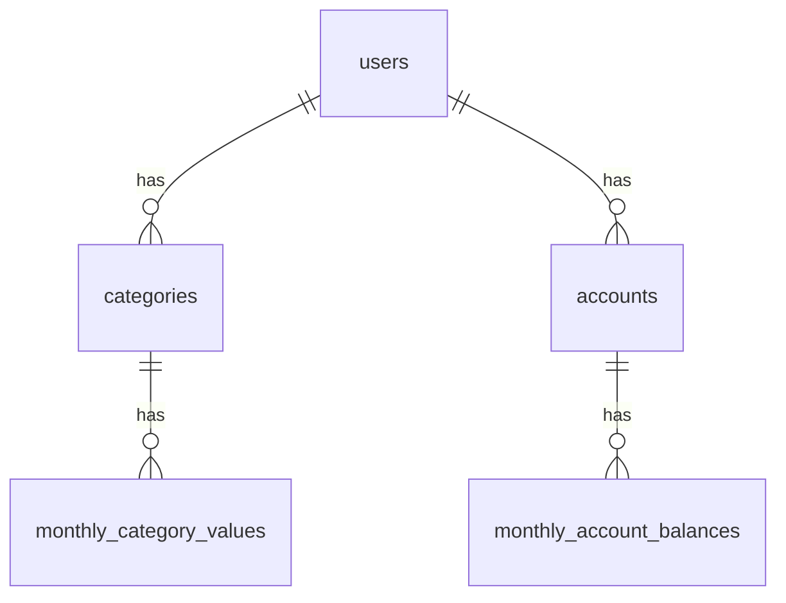

# 📑 Tsuki-Ichi 要件定義書

## 1\. プロジェクト概要

### コンセプト

  * **脱・レシート管理**: 日々の細かい支出記録をやめ、月単位の「大枠の管理」に特化する。
  * **フローとストックの分離**: 「月間の収支 (PL)」と「月末時点の資産残高 (BS)」を独立して入力・管理する。
  * **モバイルファースト**: スマホでの「月イチ入力」を最速で行えるUI/UX。

### ターゲット

  * 開発者本人（個人利用）

## 2\. 技術スタック

| Category | Technology | Note |
| :--- | :--- | :--- |
| **Frontend** | SvelteKit (TypeScript) | アプリケーションフレームワーク |
| **Styling** | Tailwind CSS | UIコンポーネント・レイアウト |
| **Database** | Supabase (PostgreSQL) | データ永続化 |
| **Auth** | Supabase Auth | ユーザー認証・RLS |
| **Deployment** | Vercel | ホスティング |

## 3\. 機能要件

### 3.1 認証 (Authentication)

  - [ ] メールアドレス/パスワードによるサインアップ・ログイン
  - [ ] ログイン状態の永続化
  - [ ] ユーザーごとのデータ分離（RLS: Row Level Security）

### 3.2 ダッシュボード (Dashboard)

アプリのトップ画面。現状を一目で把握する。

  - [ ] **対象月切り替え**: 過去/未来の月へ移動できるナビゲーション
  - [ ] **総資産サマリー**: 全口座の合計金額と、前月比（増減）の表示
  - [ ] **月次収支サマリー**: 当月の「収入合計 - 支出合計」の表示
  - [ ] **グラフ表示**:
      - [ ] 支出の内訳円グラフ（カテゴリー別）
      - [ ] 資産のポートフォリオ円グラフ（口座別）

### 3.3 一括入力 (Batch Input)

Excelライクなリスト形式で数値を直接入力・更新する。

  - [ ] **収支入力タブ (PL)**:
      - [ ] 収入/支出カテゴリーごとの入力欄表示
      - [ ] 数値の変更と保存（Upsert処理）
  - [ ] **資産入力タブ (BS)**:
      - [ ] 口座ごとの残高入力欄表示
      - [ ] 数値の変更と保存（Upsert処理）

### 3.4 設定 (Settings)

マスタデータの管理。

  - [ ] **カテゴリー管理**: 費目の追加・編集・削除
  - [ ] **口座管理**: 管理する口座（銀行・財布等）の追加・編集・削除

## 4\. データベース設計

### 4.1 ER図 概要



### 4.2 テーブル定義

#### `categories` (費目マスタ)

| Column | Type | Description |
| :--- | :--- | :--- |
| `id` | bigint | PK |
| `user_id` | uuid | FK (auth.users) |
| `name` | text | 名称 (例: 食費) |
| `type` | text | `income` (収入) / `expense` (支出) |

#### `accounts` (口座マスタ)

| Column | Type | Description |
| :--- | :--- | :--- |
| `id` | bigint | PK |
| `user_id` | uuid | FK (auth.users) |
| `name` | text | 名称 (例: 三井住友銀行) |
| `type` | text | `cash`, `bank`, `securities` 等 (任意) |

#### `monthly_category_values` (PL実績)

| Column | Type | Description |
| :--- | :--- | :--- |
| `id` | bigint | PK |
| `year` | int | 対象年 (2024) |
| `month` | int | 対象月 (5) |
| `category_id` | bigint | FK (categories) |
| `amount` | int | 金額 |

#### `monthly_account_balances` (BS残高)

| Column | Type | Description |
| :--- | :--- | :--- |
| `id` | bigint | PK |
| `year` | int | 対象年 (2024) |
| `month` | int | 対象月 (5) |
| `account_id` | bigint | FK (accounts) |
| `balance` | int | 残高金額 |

## 5\. UI/UX フロー

1.  **Login**: 未認証時はログイン画面へリダイレクト
2.  **Dashboard**: ログイン後のホーム。グラフとサマリーを表示。
3.  **Input**: ダッシュボードのFAB（またはボタン）から遷移。タブで「収支」「資産」を切り替えて入力し、保存して戻る。
4.  **Settings**: 必要に応じてカテゴリーや口座を増減させる。

## 6\. ディレクトリ構成案 (SvelteKit)

```text
src/
├── lib/
│   ├── components/     # 共通コンポーネント (Button, Input, Card...)
│   ├── server/         # DB接続などのサーバーサイドロジック
│   └── stores/         # 状態管理 (必要であれば)
├── routes/
│   ├── +layout.svelte  # 全体レイアウト (ヘッダー等)
│   ├── +page.svelte    # ダッシュボード (Dashboard)
│   ├── input/
│   │   └── +page.svelte # 入力画面 (Batch Input)
│   ├── settings/
│   │   └── +page.svelte # 設定画面 (Settings)
│   └── auth/           # ログイン・サインアップ
└── app.html
```
